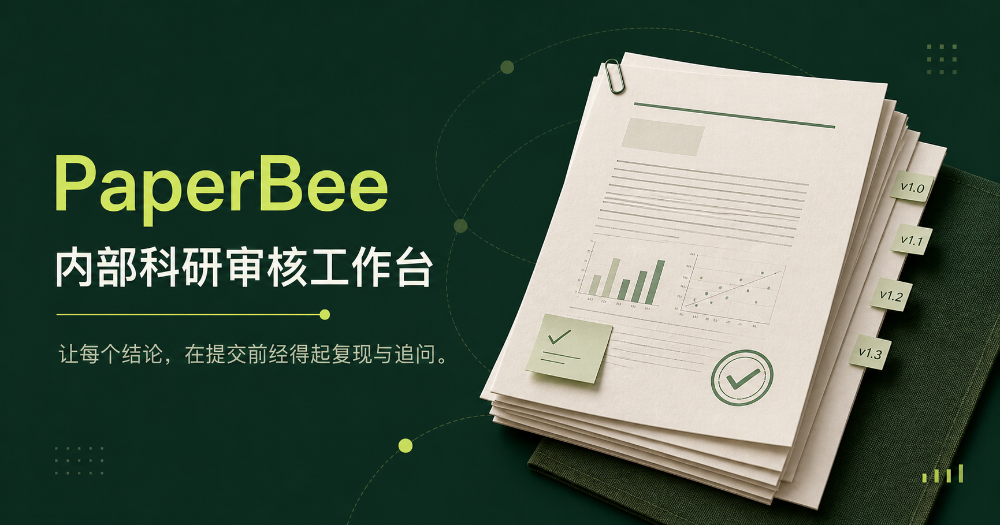
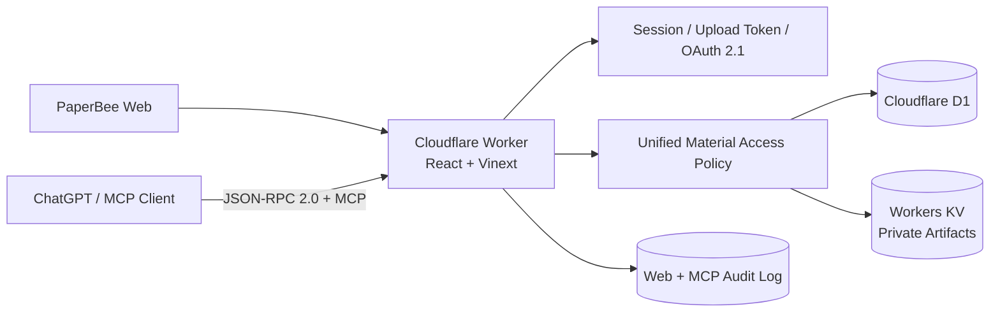

# PaperBee

> AI 原生科研项目管理与内部同行评审平台：通过自研 MCP Server 与 OAuth 2.1，将 ChatGPT 安全接入科研材料上传、检索和阅读流程。



## 项目定位

PaperBee 面向高校课题组与学院内部使用，将科研项目材料、固定版本、审核任务、结构化评审报告和访问记录统一到一套受控流程中。项目重点不是“调用一次大模型 API”，而是把 ChatGPT 作为受约束的外部客户端接入现有权限系统，并确保 AI 入口不会绕过网页端的材料访问策略。

代码仓库为脱敏后的作品展示版本，不包含生产数据库、科研文件、真实 Cloudflare 资源标识、环境密钥或原始开发提交历史。

## 技术亮点

- 基于 JSON-RPC 2.0 实现兼容 Model Context Protocol（MCP）的服务端，提供项目上传、查询和材料读取工具。
- 实现 OAuth 2.1 Authorization Code + PKCE S256、动态客户端注册、短期 Access Token、Refresh Token Rotation 与令牌族重放撤销。
- 上传、网页登录和 OAuth 读取使用三类相互隔离的凭据；AI 上传令牌 60 分钟有效，成功使用一次后立即失效。
- 网页预览、受控下载和 ChatGPT MCP 共用材料级授权策略；论文和复现包可按项目所有者、管理员及当前审稿人动态授权。
- Markdown/TXT 小文件以内联文本返回，PDF、DOCX 和压缩包通过受保护 MCP Resource 返回，读取时再次检查权限。
- 基于 Cloudflare D1 与 Drizzle ORM 设计 17 张业务与安全数据表，以 Workers KV 保存私有科研材料。
- 建立统一访问审计，记录网页下载、MCP 查询、资源读取、成功/拒绝结果及拒绝原因。
- 自动化测试覆盖 OAuth 注册、PKCE、授权码兑换、Token 轮换、密码变更失效、双账号材料隔离及审计链路。

## 系统架构



## MCP 能力

| Tool | 鉴权方式 | 功能 |
| --- | --- | --- |
| `check_paperbee_connection` | 无需授权 | 检查 MCP 服务和直接文件上传能力 |
| `upload_research_project` | 一次性上传令牌 | 从 ChatGPT 对话或文件库提交真实材料文件 |
| `list_accessible_projects` | OAuth 2.1 | 查询当前成员可访问的项目与材料权限 |
| `get_project` | OAuth 2.1 | 通过 `PB-XXXXXX` 或 UUID 读取项目详情 |
| `read_project_material` | OAuth 2.1 | 读取中文说明、AI 预审、论文或复现包 |

MCP Resource 使用 `paperbee://projects/{projectCode}/materials/{kind}` URI。服务端不会生成永久公开文件链接，也不会自动解压或执行复现包。

## OAuth 与安全边界

- OAuth Scope 固定为 `paperbee:read`，授权码绑定 Client、Redirect URI、Resource、Scope 与 PKCE Challenge。
- 授权码、会话 Token、上传 Token、Access Token 和 Refresh Token 均只保存不可逆哈希。
- Access Token 有效期为 1 小时；Refresh Token 有效期为 30 天且每次使用后轮换。
- 检测到已消费 Refresh Token 重放时，撤销整个 Token Family。
- 成员修改密码后递增凭据版本，使旧授权码与已连接的 OAuth 凭据失效。
- OAuth 注册及授权入口包含请求体大小限制、回调 URI 校验和分层限流。
- 单个上传文件限制为 25 MB；MCP 二进制资源读取限制为 8 MB。

## 审核工作流

1. 成员上传中文说明、AI 预审、论文和复现包。
2. 项目作者或管理员指定审稿人，成员也可认领未分配项目。
3. 审稿人检查正确性、复现性、数据与伦理，并提交结构化报告。
4. 系统关联项目、材料版本、审核任务和评审报告，保留完整访问审计。

## 技术栈

- TypeScript 5、React 19、React Server Components
- Vinext、Vite 8、Tailwind CSS
- Cloudflare Workers、D1、Workers KV、workerd
- Drizzle ORM
- MCP、JSON-RPC 2.0、OAuth 2.1、PKCE S256、OpenAPI 3.1
- React Markdown、GFM、KaTeX、HTML Sanitization
- Node.js Test Runner

## 关键代码

- [`app/mcp/route.ts`](app/mcp/route.ts)：MCP 协议入口、Tool 定义和 ChatGPT 文件上传。
- [`lib/mcp-project-reading.ts`](lib/mcp-project-reading.ts)：项目查询、材料读取和受保护 Resource。
- [`lib/oauth-auth.ts`](lib/oauth-auth.ts)：Bearer Token 验证与 OAuth Challenge。
- [`app/oauth/token/route.ts`](app/oauth/token/route.ts)：授权码交换、Token Rotation 与重放撤销。
- [`lib/project-access.ts`](lib/project-access.ts)：Web 与 MCP 共用的材料授权策略。
- [`db/schema.ts`](db/schema.ts)：项目、版本、审核、OAuth 与审计数据模型。
- [`tests/oauth-integration.test.mjs`](tests/oauth-integration.test.mjs)：基于 workerd 的 OAuth/MCP 端到端验证。

## 本地运行

要求 Node.js `>=22.13.0`。

```bash
npm install
cp .env.example .env.local
npm run dev
```

本地开发会使用项目目录内的 Miniflare 状态，不连接生产 D1 或 KV。生产部署前必须自行创建 Cloudflare 资源，并配置 `.env.example` 中列出的变量和 Worker Secret。

## 验证

```bash
npm test
npx tsc --noEmit
npm run lint
```

测试套件包含 35 项测试，包括一条完整的 OAuth、MCP、撤销、双账号隔离与审计集成链路。

## 数据与隐私

本仓库不包含真实用户、内部科研项目、论文、复现代码、数据库快照或生产凭据。请勿向公开测试或 Issue 上传未发表科研材料与个人信息。

## 使用许可

本仓库用于个人作品展示和技术交流，未授予复制、再发布、商业部署或衍生开发许可。详见 [`COPYRIGHT.md`](COPYRIGHT.md)。

